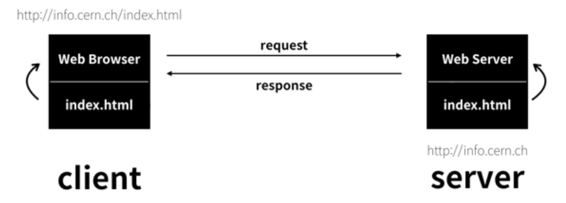

<h2>인터넷을 여는 열쇠 : 서버와 클라이언트</h2>

<h4>웹의 시작은 어디인가.</h4>

 

1. 웹 브라우저 : request >> "index.html을 주세요"
1. 웹 서버 : response >> "여기 코드있어요"
1. 웹 브라우저 : 코드 해독 후 웹페이지 화면에 출력

- 웹 브라우저 >> 요청(request) : 클라이언트(client)
- 웹 서버 >> 응답(response) : 서버(server)

- 웹 호스팅 vs 웹 서버
    - 업체의 서버를 사용 > 쉽지만, 블랙박스
    - 웹 서버 설치 > 어렵지만, 지식&정보
    ~~~
    필자가 추천하는 방향은
    웹호스팅으로 쉽게 목표를 달성한 후에
    웹서버를 직접 설치하는 방법을 공부해 보세요.
    ~~~